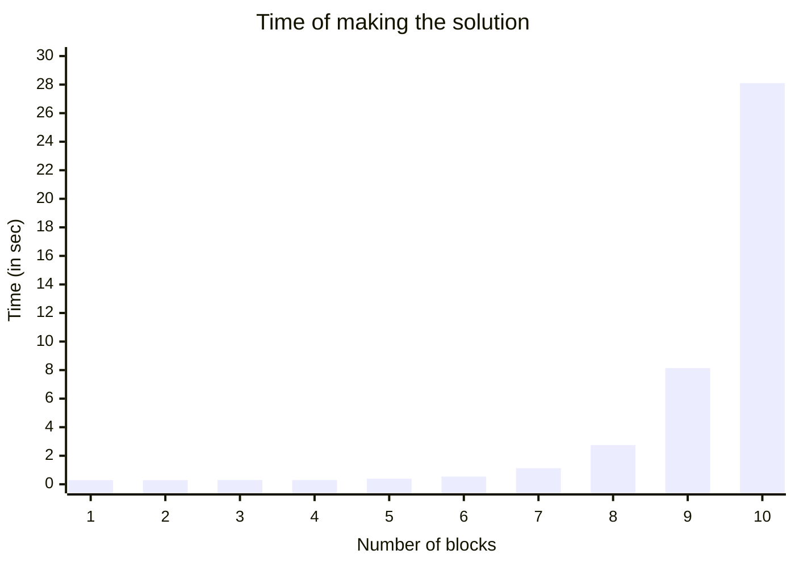

Treatment the puzzle: [wiki](https://en.wikipedia.org/wiki/Tower_of_Hanoi)

To representant objects of this puzzle you need 2 classes with mutual parent:


```cs
public class HanoiObj //It cannot be abstract
{
    public HanoiBrick HanoiBrickUpSide = null;
}

public class HanoiBrick : HanoiObj
{
    readonly public int Size;

    public HanoiBrick(int size)
    {
       this.Size = size;
    }
}

public class HanoiTable : HanoiObj
{
    public readonly int no;

    public HanoiTable(int no, HanoiBrick HanoiBrickUpSide = null)
    {
        this.no = no;
        this.HanoiBrickUpSide = HanoiBrickUpSide;
    }
}
```
As you can see HanoiBrick and HanoiTable are kind of HanoiObj. At this puzzle brick can be put at table and also at another brick. Reflection of this rule is HanoiBrickUpSide the member of HanoiObj class.

Two putting-rule implement two action of moving brick. The different is only in benchmark moving brick size against new pedestal brick size

```cs
ActionPDDL moveBrickOnBrick = new ActionPDDL("Move brick onto another brick"); //1st action with 3 parameters: MovedBrick, ObjBelowMoved, NewStandB

moveBrickOnBrick.AddPartOfActionSententia(ref MovedBrick, "Place the {0}-size brick ", MB => MB.Size);
moveBrickOnBrick.AddPartOfActionSententia(ref NewStandB, "onto {0}-size brick.", MB => MB.Size);

moveBrickOnBrick.AddPrecondition("Moved brick is no up", ref MovedBrick, HO => HO.HanoiBrickUpSide == null); //MovedBrick.HanoiBrickUpSide == null
moveBrickOnBrick.AddPrecondition("New stand is empty", ref NewStandB, HO => HO.HanoiBrickUpSide == null); //NewStandB.HanoiBrickUpSide == null
moveBrickOnBrick.AddPrecondition("Small brick on bigger one", ref MovedBrick, ref NewStandB, (MB, NSB) => (MB.Size < NSB.Size)); //MovedBrick.Size < NewStandB.Size
moveBrickOnBrick.AddPrecondition("Find brick bottom moved one", ref MovedBrick, ref ObjBelowMoved, (MB, OBM) => (MB == OBM.HanoiBrickUpSide)); //MovedBrick == ObjBelowMoved.HanoiBrickUpSide

moveBrickOnBrick.AddEffect("Old stand is empty", ref ObjBelowMoved, NS => NS.HanoiBrickUpSide, null); //ObjBelowMoved.HanoiBrickUpSide = null
moveBrickOnBrick.AddEffect("Consociate Bricks", ref NewStandB, NSB => NSB.HanoiBrickUpSide, ref MovedBrick); //NewStandB.HanoiBrickUpSide = MovedBrick
```
The other action is very similar and it consist in putting the brick on vacant table spot.

Similarity of both action is visible in "case use diagram" generated by library.


Solution output for 3-bricks-hanoi-tower problem:
```
Move brick on table: Place the 1-size brick onto table no 2.
Move brick on table: Place the 2-size brick onto table no 1.
Move brick onto another brick: Place the 1-size brick onto 2-size brick.
Move brick on table: Place the 3-size brick onto table no 2.
Move brick on table: Place the 1-size brick onto table no 0.
Move brick onto another brick: Place the 2-size brick onto 3-size brick.
Move brick onto another brick: Place the 1-size brick onto 2-size brick.
```

The game state diagram generated by SharpPDDL library for 8 brick problem shows the relatedness to the Sierpiński triangle.



As you can see founding solution of it is roughly cubic time complexity - $O(n^3)$