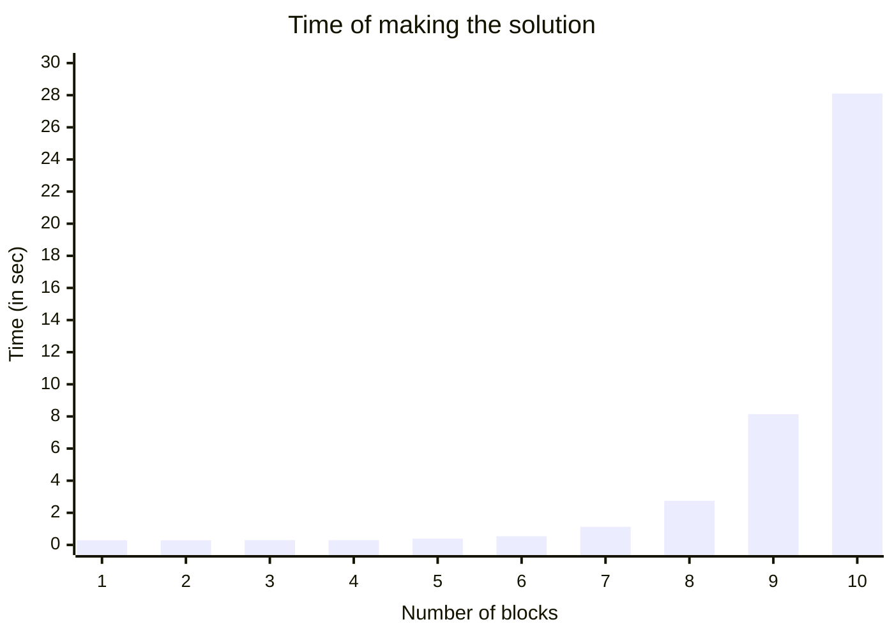

Treatment the puzzle: [wiki](https://en.wikipedia.org/wiki/Tower_of_Hanoi)
```cs
public class HanoiObj //It cannot be abstract
{
    public int HanoiObjSizeUpSide = 0;
    public bool IsEmptyUpSide;
}

public class HanoiBrick : HanoiObj
{
    readonly public int Size;
}

public class HanoiTable : HanoiObj
{
    public readonly int no;
}
```
```mermaid

classDiagram

namespace Legend {

    class Class{
        Its a block representant some class
    }

    class Object {
        Its a block representant some object / class instance
    }

}

    style Object fill:#391, stroke-style:..
    style Class fill:#139, stroke-style:..

namespace HanoiTower {

    class HanoiObj{
        +int HanoiObjSizeUpSide
        +bool IsEmptyUpSide
    }

    class HanoiBrick{
        +int Size
    }

    class HanoiTable {
        +int no
    }
}
    HanoiObj <|-- HanoiBrick
    HanoiObj <|-- HanoiTable

    style HanoiObj fill:#139, stroke-style:..
    style HanoiBrick fill:#139, stroke-style:..
    style HanoiTable fill:#139, stroke-style:..

namespace SharpPDDL {

    class Root_TreeNode{
        ~SingleTypeOfDomain Content
        ~List~TreeNode~ Children 
    }

    class HanoiObj_SingleTypeOfDomain {
        ~Type Type : BaseShapes.HanoiObj
        ~List~ValueOfThumbnail~ CumulativeValues 
    }

    class 0_TreeNode{
        ~SingleTypeOfDomain Content
        ~List~TreeNode~ Children 
    }

    class HanoiBrick_SingleTypeOfDomain {
        ~Type Type : BaseShapes.HanoiObj
        ~List~ValueOfThumbnail~ CumulativeValues 
    }

    class 1_TreeNode{
        ~SingleTypeOfDomain Content
        ~List~TreeNode~ Children 
    }

    class HanoiTable_SingleTypeOfDomain {
        ~Type Type : BaseShapes.HanoiObj
        ~List~ValueOfThumbnail~ CumulativeValues 
    }
}
    style Root_TreeNode fill:#391, stroke-style:..
    style 0_TreeNode fill:#391, stroke-style:..
    style 1_TreeNode fill:#391, stroke-style:..
    style HanoiObj_SingleTypeOfDomain fill:#391, stroke-style:..
    style HanoiBrick_SingleTypeOfDomain fill:#391, stroke-style:..
    style HanoiTable_SingleTypeOfDomain fill:#391, stroke-style:..
    
    Root_TreeNode --> "Children[0]" 0_TreeNode
    Root_TreeNode --> "Children[1]" 1_TreeNode
    0_TreeNode --> "Content" HanoiBrick_SingleTypeOfDomain
    1_TreeNode --> "Content" HanoiTable_SingleTypeOfDomain
    Root_TreeNode --> "Content" HanoiObj_SingleTypeOfDomain
    HanoiObj_SingleTypeOfDomain ..> "≙" HanoiObj
    HanoiBrick_SingleTypeOfDomain ..> "≙" HanoiBrick
    HanoiTable_SingleTypeOfDomain ..> "≙" HanoiTable

    note for HanoiObj_SingleTypeOfDomain "CumulativeValues:<br> 1: HanoiObSizeUpSide<br> 2: IsEmptyUpSide"
    note for HanoiTable_SingleTypeOfDomain "CumulativeValues:<br> 1: HanoiObSizeUpSide<br> 2: IsEmptyUpSide<br> // int:no is not use in any action"
    note for HanoiBrick_SingleTypeOfDomain "CumulativeValues:<br> 1: HanoiObSizeUpSide<br> 2: IsEmptyUpSide<br> 3: Size"

```
Instances of class used to define action shouldn't be use in other part of program. In time of create actions library create class instance excluding use the class constructor.

For these classes one can define rules in library like "Move brick onto another brick" or "Move brick on table". Preconditions, effect etc. are phrased by library's user as Expressions (System.Linq.Expressions):

```cs
HanoiBrick MovedBrick = null; //you can take brick...
HanoiObj ObjBelowMoved = null; //...from table or another brick... 
HanoiBrick NewStandB = null; //...and put it into bigger brick...
HanoiTable NewStandT = null; //...or empty table spot.

Expression<Predicate<HanoiObj>> ObjectIsNoUp = (HO => HO.IsEmptyUpSide); //Moved brick have to be empty up side
Expression<Predicate<HanoiBrick, HanoiBrick>> PutSmallBrickAtBigger = ((MB, NSB) => (MB.Size < NSB.Size)); //you can put smaller brick onto bigger one
Expression<Predicate<HanoiBrick, HanoiObj>> FindObjBelongMovd = ((MB, OBM) => (MB.Size == OBM.HanoiObjSizeUpSide));

ActionPDDL moveBrickOnBrick = new ActionPDDL("Move brick onto another brick"); //1st action with 3 parameters: MovedBrick, ObjBelowMoved, NewStandB

moveBrickOnBrick.AddPartOfActionSententia(ref MovedBrick, "Place the {0}-size brick ", MB => MB.Size);
moveBrickOnBrick.AddPartOfActionSententia(ref NewStandB, "onto {0}-size brick.", MB => MB.Size);

moveBrickOnBrick.AddPrecondition("Moved brick is no up", ref MovedBrick, ObjectIsNoUp); //MovedBrick.IsEmptyUpSide == true
moveBrickOnBrick.AddPrecondition("New stand is empty", ref NewStandB, ObjectIsNoUp); //NewStandB.IsEmptyUpSide == true
moveBrickOnBrick.AddPrecondition("Small brick on bigger one", ref MovedBrick, ref NewStandB, PutSmallBrickAtBigger); //MovedBrick.Size < NewStandB.Size
moveBrickOnBrick.AddPrecondition("Find brick bottom moved one", ref MovedBrick, ref ObjBelowMoved, FindObjBelongMovd); //MovedBrick.Size == ObjBelowMoved.HanoiObjSizeUpSide

moveBrickOnBrick.AddEffect("New stand is full", ref NewStandB, NS => NS.IsEmptyUpSide, false); //NewStandB.IsEmptyUpSide = false
moveBrickOnBrick.AddEffect("Old stand is empty", ref ObjBelowMoved, NS => NS.IsEmptyUpSide, true); //ObjBelowMoved.IsEmptyUpSide = true
moveBrickOnBrick.AddEffect("UnConsociate Objs", ref ObjBelowMoved, OS => OS.HanoiObjSizeUpSide, 0); //ObjBelowMoved.HanoiObjSizeUpSide = 0
moveBrickOnBrick.AddEffect("Consociate Bricks", ref NewStandB, NSB => NSB.HanoiObjSizeUpSide, ref MovedBrick, MB => MB.Size); //NewStandB.HanoiObjSizeUpSide = MovedBrick.Size

newDomain.AddAction(moveBrickOnBrick); //Putting empty brick onto bigger one

ActionPDDL moveBrickOnTable = new ActionPDDL("Move brick on table"); //2st action with 3 parameters: MovedBrick, ObjBelowMoved, NewStandT

moveBrickOnTable.AddPartOfActionSententia(ref MovedBrick, "Place the {0}-size brick ", MB => MB.Size);
moveBrickOnTable.AddPartOfActionSententia(ref NewStandT, "onto table no {0}.", NS => NS.no);

moveBrickOnTable.AddPrecondition("Moved brick is no up", ref MovedBrick, ObjectIsNoUp); //MovedBrick.IsEmptyUpSide == true
moveBrickOnTable.AddPrecondition("New table is empty", ref NewStandT, ObjectIsNoUp); //NewStandT.IsEmptyUpSide == true
moveBrickOnTable.AddPrecondition("Find brick bottom moved one", ref MovedBrick, ref ObjBelowMoved, FindObjBelongMovd); //MovedBrick.Size == ObjBelowMoved.HanoiObjSizeUpSide

moveBrickOnTable.AddEffect("New stand is full", ref NewStandT, NS => NS.IsEmptyUpSide, false); //NewStandT.IsEmptyUpSide = false
moveBrickOnTable.AddEffect("Old stand is empty", ref ObjBelowMoved, NS => NS.IsEmptyUpSide, true); //ObjBelowMoved.IsEmptyUpSide = true
moveBrickOnTable.AddEffect("UnConsociate Objs", ref ObjBelowMoved, OS => OS.HanoiObjSizeUpSide, 0); //ObjBelowMoved.HanoiObjSizeUpSide = 0
moveBrickOnTable.AddEffect("Consociate Bricks", ref NewStandT, NST => NST.HanoiObjSizeUpSide, ref MovedBrick, MB => MB.Size); //NewStandT.HanoiObjSizeUpSide = MovedBrick.Size

newDomain.AddAction(moveBrickOnTable); //Putting empty brick onto empty table spot
```

Solution output for 3-bricks-hanoi-tower problem:
```
Transfer bricks onto table no. 3 determined!!! Total Cost: 7
Move brick on table: Place the 1-size brick onto table no 2.
Move brick on table: Place the 2-size brick onto table no 1.
Move brick onto another brick: Place the 1-size brick onto 2-size brick.
Move brick on table: Place the 3-size brick onto table no 2.
Move brick on table: Place the 1-size brick onto table no 0.
Move brick onto another brick: Place the 2-size brick onto 3-size brick.
Move brick onto another brick: Place the 1-size brick onto 2-size brick.
```

