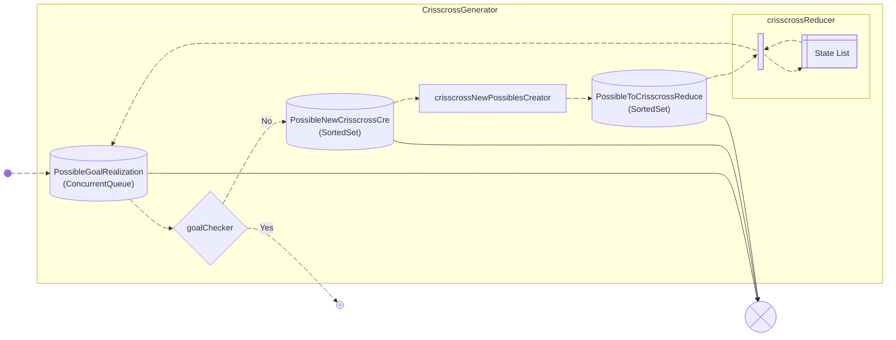

[](https://www.codefactor.io/repository/github/arbom/sharppddl/overview/master)
[](https://github.com/ArBom/SharpPDDL/actions/workflows/dotnet.yml)
[](https://github.com/ArBom/SharpPDDL/blob/master/.github/workflows/loc.yml)

[](https://www.nuget.org/packages/SharpPDDL)
[](https://nugettrends.com/packages?ids=SharpPDDL&months=12)

---

This is the class library based on PDDL intellection and in effect it's a implementation of GOAP (Goal Oriented Action Planning) algorithm. It uses only C# 7.1 standard library. Values inside classes using to find solution have to be ValueType only (most numeric, like: int, short etc., char, bool).

One can to use previously defined classes which are using in other part of one's programm. At this version library can return the plan of doing and execute it to realize the goal.

## How to use (API):
Include the library namespace with using SharpPDDL.

| Method | What is it doing? |
|---|---|
| new DomainPDDL() | Creates the instance of algorithm. |
| DomainPDDL.AddAction() | Adds action to domain. |
| DomainPDDL.domainObjects | Objects' collection manned by library. |
| DomainPDDL.AddGoal() | Adds goal to do. |
| DomainPDDL.DefineTrace() | Defines TraceSource to do trace the code execution. |
| DomainPDDL.planGenerated | delegate of List<List<string>> type. It shows a generated plan. |
| DomainPDDL.SetExecutionOptions() | Defines options of plan realization |
| DomainPDDL.GenerateDiagrams() | Types of diagram to generate and path of saving them |
| DomainPDDL.Start() | Starts the algorithm. |
| new ActionPDDL() | Creates the action to use in domein. |
| ActionPDDL.AddPrecondition() | Adds precondition of action doing. |
| ActionPDDL.AddEffect() | Adds effect of action doing. |
| ActionPDDL.DefineActionCost() | Defines action cost. |
| ActionPDDL.AddPartOfActionSententia() | Adds description of action in generated plan. |
| ActionPDDL.AddExecution() | Adds action execution of algorithm realization. |
| new GoalPDDL() | Creates the goal of algorithm run. |
| GoalPDDL.AddExpectedObjectState() | Defines a state of one of obj. manned by library as alg. goal. |

## Some easy problem

### Define actions:

The simplest action consists only of the effect of its execution.
```cs
ActionPDDL Suppling = new ActionPDDL("Supply the stocks");
Suppling.AddEffect("Take fresh food", ref person, s => s.HaveFood, true);
```

Most actions require certain conditions to be met and mode than one effect, e.g. To eat, you must have food
```cs
ActionPDDL Eat = new ActionPDDL("Eat");
Eat.AddPrecondition("Have food", ref person, s => s.HaveFood == true);
Eat.AddEffect("Replete with food", ref person, s => s.IsFull, true);
Eat.AddEffect("Less food", ref person, s => s.HaveFood, false);
```
It is worth noting at this point that the occurrence of references to the same object (person) indicates that it is Sam who must have food in order to eat it, and it is Sam who is full after consumption

There is a possibility of define an action in which two (or more) different class instances interact with each other
```cs
ActionPDDL Feed = new ActionPDDL("Feed the pet");
Feed.AddPrecondition("Have food", ref person, s => s.HaveFood == true);
Feed.AddEffect("Feed the dog", ref dog, d => d.IsFull, true);
Feed.AddEffect("Less food", ref person, s => s.HaveFood, false);
```

<picture>
  <source media="(prefers-color-scheme: dark)" srcset="https://github.com/user-attachments/assets/166fa72a-e35d-41b4-a91b-68a39ed92a92">
  <source media="(prefers-color-scheme: light)" srcset="https://github.com/user-attachments/assets/850f3d5a-6ed9-4de6-9efe-8d0c8b61c34d">
  
</picture>
Some kind of all action of domain visualization can be bring up in one case use diagram. Graph like that, generated in time of run, could be help in debug the actions and/or be part of documentation whole programm which uses this library. 
Standard UML diagram is extended here by block with preconditions of every action. In case of lack of conditions of action realization block include only unnamed decision block symbol. 
Effects set as realization of action is marked by orange arrow. Any other function added as realization is shown as realization relationship, under the official way of creating diagram like that.
Diagram path is set at GenerateDiagrams method. Diagram is save as .dgml file, which can be open by Visual Studio with DGML Viewer.

### Define goal:

It's possible to describe goal as state of one...
```cs
GoalPDDL FullDogAndSam = new GoalPDDL("Feed both");
FullDogAndSam.AddExpectedObjectState(Sam_s_Dog, SD => SD.IsFull);
```
...or more objects
```cs
GoalPDDL FullDogAndSam = new GoalPDDL("Feed both");
FullDogAndSam.AddExpectedObjectState(Sam_s_Dog, SD => SD.IsFull);
FullDogAndSam.AddExpectedObjectState(Sam, S => S.IsFull);
```
Plan generated to solve 2<sup>nd</sup> goal (Feed both) with use actions of that domain. Assumedly, in the beginning of it Sam was without food on his person.
```
Supply the stocks
Eat
Supply the stocks
Feed the pet
```
## Little more ambitious examples:

> [!TIP]
> [Get familiar with ready examples.](https://github.com/ArBom/SharpPDDL/tree/master/Examples)

First use of it could seems a little unintuitive. There is some examples of popular games and puzzles where SharpPDDL could be used.

## How is it works

1. **Building a types tree:** 

<picture>
  <source media="(prefers-color-scheme: dark)" srcset="https://github.com/user-attachments/assets/a2fe898d-b239-44a2-bd4b-a0a7c10aec87">
  <source media="(prefers-color-scheme: light)" srcset="https://github.com/user-attachments/assets/705f1bc9-4dd9-4cd9-baef-b153adf7517f">
  
</picture>
Based on the types used to define actions and their members, an types tree is built. This data structure is similar to a class diagram, but contains data about class members that are used in actions only. In case of 2 or more classes inherit from a given member, the values ​​are represented with the same tag during making the solution. This approach allows the same data representation to be used in different actions and different subclasses.

Both Person the class both Dog the class are subclass of Eater. Bool value of IsFull is used to define state of hunger in both cases. If any class contains another one, and it's changing in effect of action, that relationship could be shown at diagram.
> [!NOTE] 
>Instances of class used to define action shouldn't be use in other part of program.

In time of create actions library creates class instance with excluding use the class constructor. Therefore...

> [!WARNING]
>Classes used to define actions cannot be signed by "abstract" with modifier indicates

This problem occurs in the example of the towers of hanoi example. However, it is possible to inherit from abstract classes as in the case of river crossing problem if the reference to the abstract class is not used in the action description.

2. **Transform the added objects and goals:** Added objects and goals are transformed into internal library objects with members represented by dictionary. Keys of these are numeric tags generated at above, value in first generation (precursor) of it are read from objects.

3. **Generate new possible states:**
Generating new possible states is heart of this algorithm. To do it used  forward reasoning as repeated application of *modus ponens*. Data flow is shown at diagram:



Forward chaining starts with the data from added objects ⚫ and uses inference rules, defined domain actions, to extract more data until a goal is reached ⊚, or until generate all possible state ⊗ - moment when all buffors of this task are empty and noone subtask is working.

SharpPDDL searches the possible sets of object representation in one possible state until it finds one where the antecedent (action preconditions) are true to do an action. When such a set is found for the action, SharpPDDL conclude the consequent, resulting in the addition of new possible state.

States generated pending this process can be repetitive for different antecedents and different actions. To avoid the state explosion problem the same states are merged into one. In this process the cheapest way to reach state is defined as main root of it.

4. **In case of detect possible Goal realization**

After detect the possibility of goal realization from states witch fulfiled needment is chosen the cheapest one. At our example state named as WkwEhr is cheaper to reach than C9z8/L.

<picture>
  <source media="(prefers-color-scheme: dark)" srcset="https://github.com/user-attachments/assets/1a17235a-3b62-4475-8001-eeb02c3e86f5">
  <source media="(prefers-color-scheme: light)" srcset="https://github.com/user-attachments/assets/143d59fc-210e-426b-b540-535f207e30c9">
  
</picture>

Plan is generated by listing states from target state to init state with look at main roots. In next step list is inverted, and consecutive actions are done to change state to the final one. At this example in the begining at state tt27HT is executing "Supply the stock" action to move to state Z6hVCp, next is "Eat" action, etc. Steps from init to final states are marked by orange colour at diagram. 
To realize the solution one needs to add the execution feature to every ActionPDDL and set the execution options of domain.

---


License: [Creative Commons Attribution-NonCommercial-ShareAlike4.0](https://creativecommons.org/licenses/by-nc-sa/4.0/legalcode)
